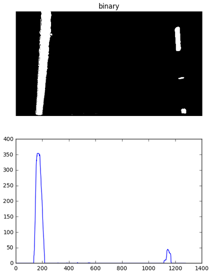
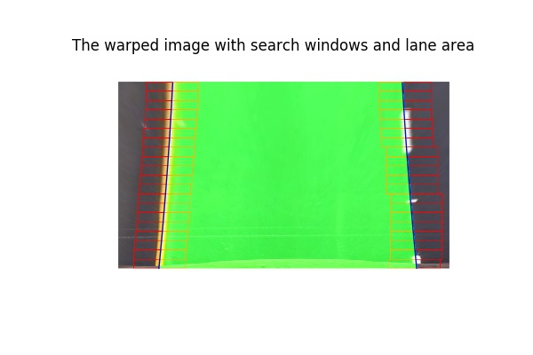
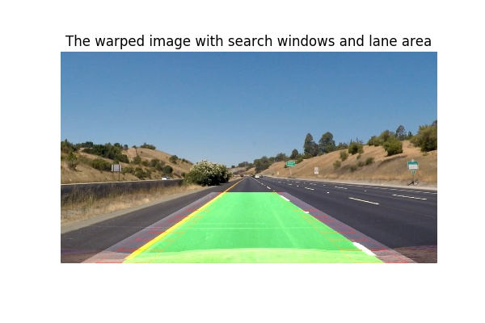
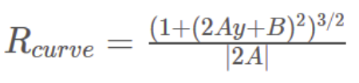

# Udacity SDC ND Advanced Lane Finding Project P4


# Objective

In this project, the goal is to write a software pipeline to identify the lane boundaries in a video recorded from a camera mounted at the center of a vehicle. Using computer vision techniques to give a video output with the detected road lane, road radius curvature and the vehicle offset from the centre.

Below is a typical image from the camera:


#### We implemented the lane finding algorithm in the following steps:

1- Compute the camera calibration matrix and distortion coefficients given a set of chessboard images.

2- Undistort camera image and apply perspective transform to get a bird-eye view of the street.

3- Convert to HSV colorspace and apply color mask to identify yellow and white lines.

4- Apply Sobel filters to HLS colorspace get image with potential line/edges.

5- Combine color masks and sobel filters.

6- Locate the Lane Lines and Fit a Polynomial.

7- Calculate the radius of curvature calculation and vehicle offset from centre.


# Algorithm

## Camera Calibration

#### Camera calibration code is available in the notebook [Camera_calibrate_undistort.ipynb](Camera_calibrate_undistort.ipynb).  

For my algorithm, I used the provided chessboard images in the the camera_cal directory. 
3D Real world space points "Object points" are based on the Chessboard size (nx=9, ny=6). For the 2D image points from the corners out from the function cv2.findChessboardCorners().

Then Calculated the Camera Calibration data and save them to camera_calibration.pkl file to be used in the main pipline to undistor images before using them to detect lanes.


#### Example of calibration image with drawing corners


#### Example of calibration images before and after undistortion


## Pipeline (single image analysis)

The analysis of the algorithm and the main code to detect lane lines are in the notebook [main.ipynb](main.ipynb).

### The implemented the lane finding algorithm in the following steps:

### 1- Display example image from test_images folder and undistor it
In this step, a new image is read by the program and the image is undistorted using precomputed camera distortion matrices.

#### Original image


#### Undistorted


### 2- Perspective transform: 
Read in the undistorted image and apply perspective transform. Perspective transformation gives us bird's eye view of the road, this makes further processing easier as any irrelevant information about background is removed from the warped image. 

This resulted in the following source and destination points:

| Source        | Destination   | 
|:-------------:|:-------------:| 
| 64.   720.    | 0.   720.     | 
| 1216.   720.  | 1280.   720.  |
| 768.   480.   | 1280.     0.  |
| 512.   480.   | 0.     0.     |


#### Undistorted with source points


#### warped with Destination points


### 3- Color Masks
Converting the image from RGB to HSV space then applying color masks to identify yellow and white pixels in the warped image. 

First, identify the yellow color by choosing the pixels with HSV channels from [ 0, 100, 100] and [ 80, 255, 255].
Second, for the white color pixels we choose HSV channels from [ 0, 0, 160] to [ 255, 80, 255].

#### Warped with yellow color choosen


#### Warped with white color choosen


#### Binary warped with white and yellow color combined


### 4- Sobel filters
In this step we apply Sobel filter for the S channel of the warped image in HLS channels space.
first we convert the image to the HLS format then we apply sobel filters in the X and Y directions to the thresholded S channel (S channel value between 70 and 255) of the warped image.

#### Warped in thresholded HLS format


#### Applying sobel X on S channel


#### Applying sobel Y on S channel


#### Combined Sobel filters


### 5- Combine color masks and sobel filters
In this step we get a binary image of the warped lanes after combining color masks and sobels filters.

#### Applying color masks and sobel filters


### 6- Locate the Lane Lines and Fit a Polynomial
For that I used Udacity algorithm and code provided in the lesson.
Now I have a binary image where the lane lines stand out clearly.

#### 1st: Taking a histogram along all the columns.



#### 2nd: Sliding Window
In this histogram will be good indicators of the x-position of the base of the lane lines. I can use that as a starting point for where to search for the lines. From that point, I can use a sliding window, placed around the line centers, to find and follow the lines up to the top of the frame. Then used that to fit a 2nd order polynomial for both left and right lanes like shown in blue color below.

Then I drew the lane area in green on the warped image.



### 3rd: Draw the lanes back on the original image

I warped the result back unto the original image using the inverse transformation matrix calculated earlier. The result is shown below:




## Pipeline (Project video)
Now from the previous pipeline we know where the lines are we have a fit! In the video frames we don't need to do a blind search again, but instead we can just search in a margin around the previous line position.

Same steps applied to the video frames(images) but added to them radius of curvature calculation and vehicle from centre offset.

### Radius of curvature calculation and vehicle from centre offset
I used Udacity algorithm and code provided in the lesson.
I used the formula below to find the radius of curvature:



A and B are the coefficients of the derivative of the second order polynomials used to find the fitted lines earlier. I calculated the radius of curvature at the point where y is maximum.

```python
y_eval = np.max(ploty)
```
I converted pixel values to meters, as in the measurement on the road using the following:

```python
# Define conversions in x and y from pixels space to meters
ym_per_pix = 30/720 # meters per pixel in y dimension
xm_per_pix = 3.7/350 # meters per pixel in x dimension

left_curverad = ((1 + (2*left_fit_cr[0]*y_eval*ym_per_pix + left_fit_cr[1])**2)**1.5) / np.absolute(2*left_fit_cr[0])
right_curverad = ((1 + (2*right_fit_cr[0]*y_eval*ym_per_pix + right_fit_cr[1])**2)**1.5) / np.absolute(2*right_fit_cr[0])
    
```

For vehicle offset:
Assuming the camera is mounted at the center of the car, such that the lane center is the midpoint between the two lines. The offset of the lane center from the center of the image (converted from pixels to meters) is the distance from the center of the lane.

Then finally I write the radius of curvature calculation and vehicle from centre offset on the video frames.

Here's a [link to my video result](./project_video_output.mp4)


## Discussion

1- The most challenging part is to come up with a robust thresholding algorithm to detect the lanes and avoiding the effect of brightness and light conditions as much as I can, but still the pipeline suffers at frames with a very high brightness.

2- For a more robust algorithm applicaple to real world application, it needs to  automatically detect the source points for warp and not just use a fixed ones like what I've chosen in my pipeline.

3- I need to improve my understanding of the colour spaces, sobel and threshold combinations more to get better results.

4- I feel that the values of curvatures are jittery, so I need a way to improve that.

5- I believe the sliding window technique should be replaced with a better more robust one.


# Resources
1- https://photographylife.com/what-is-distortion/
2- https://nl.mathworks.com/products/demos/symbolictlbx/Pixel_location/Camera_Lens_Undistortion.html
3- https://en.wikipedia.org/wiki/HSL_and_HSV
4- https://medium.com/@NickHortovanyi/advanced-lane-detection-8b98b79b9cac#.f80svu9zw
5- https://medium.com/towards-data-science/robust-lane-finding-using-advanced-computer-vision-techniques-mid-project-update-540387e95ed3#.civo03few
6- https://medium.com/@tjosh.owoyemi/finding-lane-lines-with-colour-thresholds-beb542e0d839#.eqqlysabn
