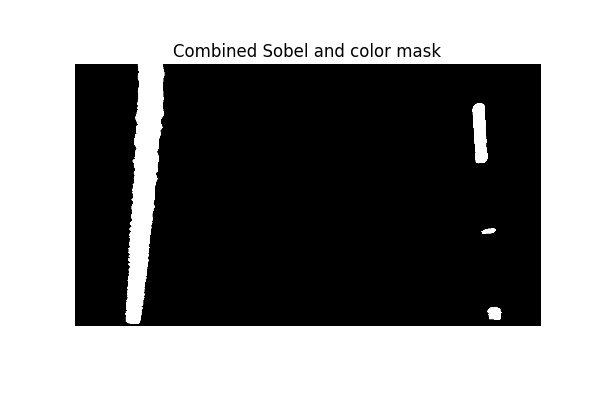
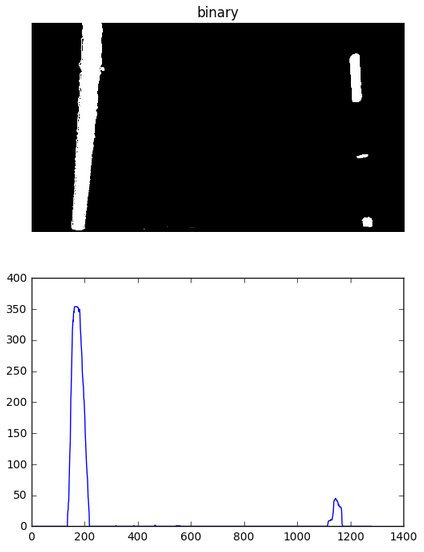
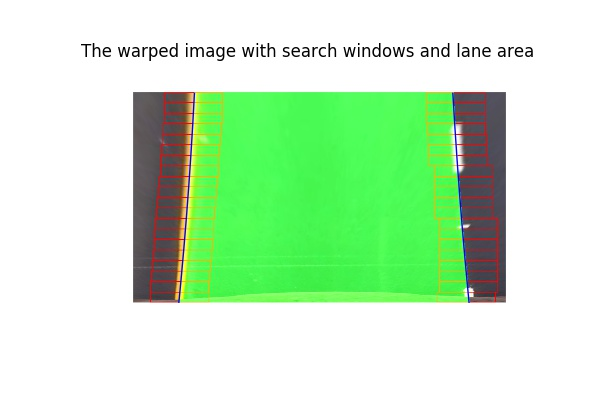
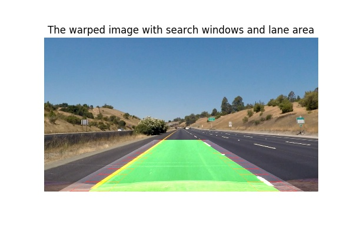
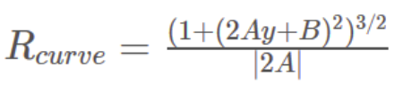

# Udacity SDC ND Advanced Lane Finding Project (P4)


The goals / steps of this project are the following:

* Compute the camera calibration matrix and distortion coefficients given a set of chessboard images.
* Apply a distortion correction to raw images.
* Use color transforms and sobel filters to create a thresholded binary image.
* Apply a perspective transform to rectify binary image ("birds-eye view").
* Detect lane pixels and fit to find the lane boundary.
* Determine the curvature of the lane and vehicle position with respect to center.
* Warp the detected lane boundaries back onto the original image.
* Output visual display of the lane boundaries and numerical estimation of lane curvature and vehicle position.

### Rubric Points
Here I will consider the rubric points individually and describe how I addressed each point in my implementation.
Available here (https://review.udacity.com/#!/rubrics/571/view)


## Camera Calibration

#### Camera calibration code is available in the notebook [Camera_calibrate_undistort.ipynb](Camera_calibrate_undistort.ipynb).  

For my algorithm, I used the provided chessboard images in the the camera_cal directory. 
3D Real world space points "Object points" are based on the Chessboard size (nx=9, ny=6). For the 2D image points from the corners out from the function cv2.findChessboardCorners().

Then Calculated the Camera Calibration data and save them to camera_calibration.pkl file to be used in the main pipline to undistor images before using them to detect lanes.


#### Example of calibration image with drawing corners


#### Example of calibration images before and after undistortion


## Pipeline (single image analysis)

#### The analysis of the algorithm and the main code to detect lane lines are in the notebook [main.ipynb](main.ipynb).

### The implemented lane finding algorithm is in the following steps:

### 1- Display example image from test_images folder and undistor it
In this step, a new image is read by the program and the image is undistorted using precomputed camera distortion matrices.

#### Original image


#### Undistorted


### 2- Perspective transform: 
Read in the undistorted image and apply perspective transform. Perspective transformation gives us bird's eye view of the road, this makes further processing easier as any irrelevant information about horizon or background is removed from the warped image. 

This resulted in the following source and destination points:

| Source        | Destination   | 
|:-------------:|:-------------:| 
| 64.   720.    | 0.   720.     | 
| 1216.   720.  | 1280.   720.  |
| 768.   480.   | 1280.     0.  |
| 512.   480.   | 0.     0.     |


#### Undistorted with source points


#### warped with Destination points


### 3- Color Masks
Converting the image from RGB to HSV space then applying color masks to identify yellow and white pixels in the warped image. 

First, identify the yellow color by choosing the pixels with HSV channels from [ 0, 100, 100] and [ 80, 255, 255].
Second, for the white color pixels we choose HSV channels from [ 0, 0, 160] to [ 255, 20, 255].

#### Warped with yellow color choosen


#### Warped with white color choosen


#### Binary warped with white and yellow color combined


### 4- Sobel filters
In this step we apply Sobel filter for the S and L channels of the warped image in HLS channels space.
first we convert the image to the HLS format then we apply sobel filters in the X and Y directions to the thresholded S  and L channels of the warped image.

#### Warped in thresholded HLS format


#### Applying sobel X on S channel


#### Applying sobel Y on S channel


#### Applying sobel X on L channel

#### Applying sobel Y on L channel


#### Combined Sobel filters


### 5- Combine color masks and sobel filters
In this step we get a binary image of the warped lanes after combining color masks and sobels filters.

#### Applying color masks and sobel filters



### 6- Locate the Lane Lines and Fit a Polynomial
For that I used Udacity algorithm and code provided in the lesson.
Now I have a binary image where the lane lines stand out clearly.

#### 1st: Taking a histogram along all the columns.



#### 2nd: Sliding Window
In this histogram will be good indicators of the x-position of the base of the lane lines. I can use that as a starting point for where to search for the lines. From that point, I can use a sliding window, placed around the line centers, to find and follow the lines up to the top of the frame. Then used that to fit a 2nd order polynomial for both left and right lanes like shown in blue color below.

Then I drew the lane area in green on the warped image.



#### 3rd: Draw the lanes back on the original image

I warped the result back into the original image using the inverse transformation matrix calculated earlier. The result is shown below:




## Pipeline (Project video)
Now from the previous pipeline we know where the lines are, in the video frames we don't need to do a blind search again, but instead we can just search in a margin around the previous lines position.

Same steps above applied to the video frames(images) but added to them radius of curvature calculation and vehicle offset from the centre.

### Radius of curvature calculation and vehicle offset from centre
I used Udacity algorithm and code provided in the lesson.

I used the formula below to find the radius of curvature:



A and B are the coefficients of the derivative of the second order polynomials used to find the fitted lines earlier. I calculated the radius of curvature at the point where y is maximum.

```python
y_eval = np.max(ploty)
```
I converted pixel values to meters, as in the measurement on the road using the following:

```python
# Define conversions in x and y from pixels space to meters
ym_per_pix = 30/720 # meters per pixel in y dimension
xm_per_pix = 3.7/350 # meters per pixel in x dimension

left_curverad = ((1 + (2*left_fit_cr[0]*y_eval*ym_per_pix + left_fit_cr[1])**2)**1.5) / np.absolute(2*left_fit_cr[0])
right_curverad = ((1 + (2*right_fit_cr[0]*y_eval*ym_per_pix + right_fit_cr[1])**2)**1.5) / np.absolute(2*right_fit_cr[0])
    
```

For vehicle offset:
Assuming the camera is mounted at the front center of the vehicle, such that the lane center is the midpoint between the two lines. The offset of the lane center from the center of the image (converted from pixels to meters) is the distance from the center of the lane.

Then finally I write the radius of curvatures and vehicle offset from the centre on the video frames.

Here's a [link to my video result](./project_video_output.mp4)


## Discussion

1- The most challenging part in the project was to come up with a robust thresholding algorithm to detect the lanes and avoiding the effect of brightness and light conditions as much as I can, but still the pipeline suffers at frames with a very high brightness.

2- For a more robust algorithm applicable to real world application, it needs to  automatically detect the source points for warp and not just use a fixed points like what I've chosen in my pipeline.

3- I need to improve my understanding of the different colour spaces, sobel and threshold combinations more to get better results.

4- I feel that the values of curvatures are jittery, so I need a way to improve that.

5- I believe the sliding window technique should be replaced with a better more robust one.
 

