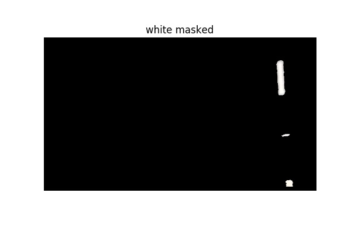
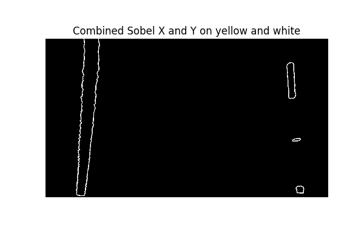

# Udacity SDC ND Advanced Lane Finding Project (P4)

The goals / steps of this project are the following:

* Compute the camera calibration matrix and distortion coefficients given a set of chessboard images.
* Apply a distortion correction to raw images.
* Use color transforms and sobel filters to create a thresholded binary image.
* Apply a perspective transform to rectify binary image ("birds-eye view").
* Detect lane pixels and fit to find the lane boundary.
* Determine the curvature of the lane and vehicle position with respect to center.
* Warp the detected lane boundaries back onto the original image.
* Output visual display of the lane boundaries and numerical estimation of lane curvature and vehicle position.

### Rubric Points
Here I will consider the rubric points individually and describe how I addressed each point in my implementation.
Available here (https://review.udacity.com/#!/rubrics/571/view)

## Camera Calibration

### Camera calibration code is available in the notebook [Camera_calibrate_undistort.ipynb](Camera_calibrate_undistort.ipynb).  

For my algorithm, I used the provided chessboard images in the the camera_cal directory. 
3D Real world space points "Object points" are based on the Chessboard size (nx=9, ny=6). For the 2D image points from the corners out from the function cv2.findChessboardCorners().

Then Calculated the Camera Calibration data and save them to camera_calibration.pkl file to be used in the main pipline to undistor images before using them to detect lanes.

#### Example of calibration image with drawing corners

#### Example of calibration images before and after undistortion

## Pipeline (single image analysis)

The analysis of the algorithm and the main code to detect lane lines are in the notebook [main.ipynb](main.ipynb).

### The implemented the lane finding algorithm in the following steps:

### 1- Display example image from test_images folder and undistor it
In this step, a new image is read by the program and the image is undistorted using precomputed camera distortion matrices.

#### Original image

#### Undistorted

### 2- Perspective transform: 
Read in the undistorted image and apply perspective transform. Perspective transformation gives us bird's eye view of the road, this makes further processing easier as any irrelevant information about background is removed from the warped image. 

This resulted in the following source and destination points:

| Source        | Destination   | 
|:-------------:|:-------------:| 
| 64.   720.    | 0.   720.     | 
| 1216.   720.  | 1280.   720.  |
| 768.   480.   | 1280.     0.  |
| 512.   480.   | 0.     0.     |

#### Undistorted with source points

#### warped with Destination points

### 3- Color Masks
Converting the image from RGB to HSV space then applying color masks to identify yellow and white pixels in the warped image. 

First, identify the yellow color by choosing the pixels with HSV channels from [ 0, 100, 100] and [ 80, 255, 255].
Second, for the white color pixels we choose HSV channels from [ 0, 0, 160] to [ 255, 80, 255].

#### Warped with yellow color choosen

#### Warped with white color choosen

#### Binary warped with white and yellow color combined

### 4- Sobel filters
In this step we apply Sobel filter for the S channel of the warped image in HLS channels space.
first we convert the image to the HLS format then we apply sobel filters in the X and Y directions to the thresholded S channel (S channel value between 70 and 255) of the warped image.

#### Warped in thresholded HLS format

#### Applying sobel X on S channel

#### Applying sobel Y on S channel

#### Combined Sobel filters

### 5- Combine color masks and sobel filters
In this step we get a binary image of the warped lanes after combining color masks and sobels filters.

#### Applying color masks and sobel filters

###Pipeline (video)

####1. Provide a link to your final video output.  Your pipeline should perform reasonably well on the entire project video (wobbly lines are ok but no catastrophic failures that would cause the car to drive off the road!).

Here's a [link to my video result](./project_video.mp4)

---

###Discussion

####1. Briefly discuss any problems / issues you faced in your implementation of this project.  Where will your pipeline likely fail?  What could you do to make it more robust?

Here I'll talk about the approach I took, what techniques I used, what worked and why, where the pipeline might fail and how I might improve it if I were going to pursue this project further.  

